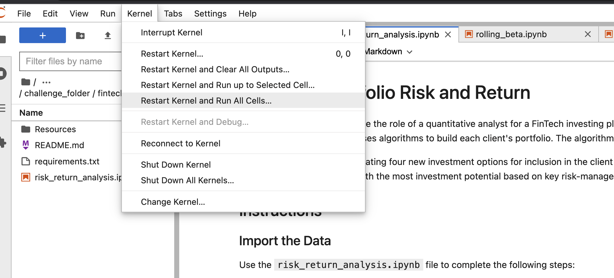

# Investment Portfolio's Risk Analysis

## Table of Contents


1. Project Motivation
2. About the Application
3. Techologies Used
4. File Descriptions
5. How to Run
6. Contributors
7. License

--------------

## Project Motivation
This project is in completion of the Columbia University FinTech 2022 bootcamp module four weekly challenge exercise.


## About the Application

This application is use to perform risk analysis on different investment portfolio and how the change is S&P 500 affects the portfolio's performance.

-----

## Technologies Used
The application is written in python programming langauge. Users need a device that can run python3 applications. Other python applications, libraries and frameworks used in this project include:

1. jupyterlab
See requirements.txt for list of all libaries used.

---------- 

## File Descriptions
1. Data folder:

       Resources/whale_navs.csv
2. Images

       how_to_run.jpg

3. requirements.txt
4. risk_return_analysis.ipynp
5. README.md

------------

## How to Run

1. Clone this repo https://github.com/ruejo2013/fintech_module_4.git

2. Navigate to the folder 

  ``` cd <location of file>
    conda create -n <evn_name> python=3.7 
    conda activate <evn_name>
    git clone <link to repo>
    pip install -r requirements.txt 
   
```

    
3. Open the risk_return_analysis.ipynb on jupyterlab in the conda env just activated.



This will run the notebook, generate some charts, and statistical analysis for the different portfolios.

--------------

## Contributors

This project is in collaboration with the Columbia University FinTech 2022 bootcamp team, and extended by Patrick R. For questions and comments kindly contact Patrick via email on pruejoma@gmail.com

-----------------------------

## License

This project is in completion of the Columbia University FinTech 2022 bootcamp module four weekly challenge exercise. It should not be copied and used for commercial purpose without the authorization of the admin of this repo. For futher information please contact Patrick via email on pruejoma@gmail.com
